# Nexora Academy — Projeto XPE

Este repositório contém o projeto Nexora Academy, desenvolvido como parte do desafio final para Arquiteto(a) de Software.

## Estrutura do Repositório

- `nexora-academy-api/` — API principal em NestJS
- `ai-bots/` — Bots de automação (Jira, GitHub, testes)
- `docs/` — Documentação de arquitetura, diagramas e requisitos
- `v1/` — Versões dos artefatos e documentação

## Principais Funcionalidades

- API modular com DDD, MVC e integração com Keycloak
- Automação de tarefas no Jira (épicos, histórias, tasks)
- Bots para testes automatizados e integração contínua
- Infraestrutura pronta para deploy com Docker, Helm e ArgoCD

## Como Executar

1. Instale as dependências:
   ```bash
   cd nexora-academy-api
   npm install
   ```
2. Inicie o ambiente de desenvolvimento:
   ```bash
   npm run start:dev
   ```
3. Para rodar os bots, consulte a pasta `ai-bots/`.

## Documentação

A documentação detalhada está na pasta `docs/` e nos arquivos Markdown da raiz e subpastas.

## Diagramas do Projeto

### 1. Contexto de Negócio
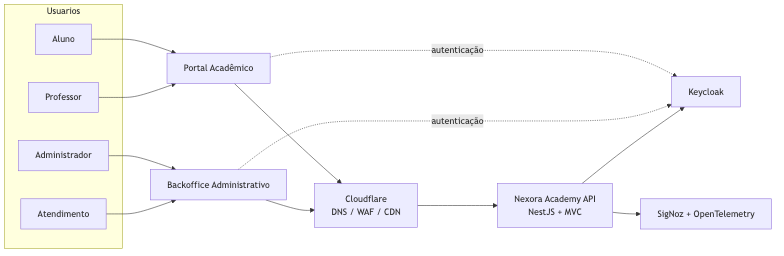
> **Descrição:** Este diagrama apresenta o contexto geral do negócio, mostrando os principais atores, sistemas externos e como eles interagem com a plataforma Nexora Academy.

### 2. Containers da Plataforma
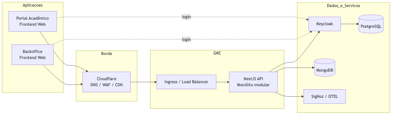
> **Descrição:** Exibe a arquitetura de containers da solução, detalhando os principais módulos, serviços e suas comunicações dentro da infraestrutura.

### 3. Componentes da API
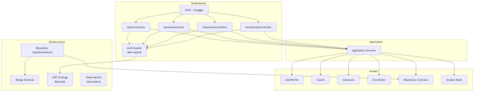
> **Descrição:** Mostra os principais componentes internos da API, suas responsabilidades e como se relacionam para atender às funcionalidades do sistema.

### 4. Contextos de Domínio
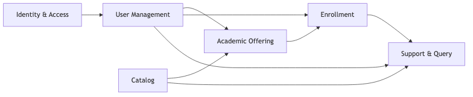
> **Descrição:** Ilustra a divisão dos contextos de domínio do sistema, facilitando a compreensão dos limites e integrações entre diferentes áreas de negócio.

### 5. Event Storming Core
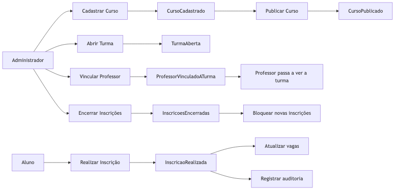
> **Descrição:** Representa o fluxo de eventos principais do domínio, auxiliando na identificação de comandos, eventos e agregados relevantes.

### 6. Sequência de Inscrição
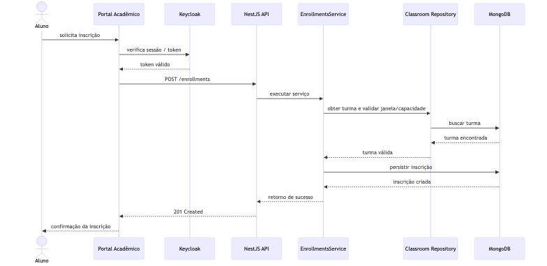
> **Descrição:** Detalha o passo a passo do processo de inscrição de um usuário em um curso, desde a solicitação até a confirmação.

### 7. Commit Automatizado com IA
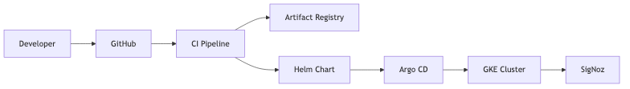
> **Descrição:** Este diagrama ilustra como o processo de commit e deploy foi automatizado utilizando bots de IA. O desenvolvedor fornece apenas um resumo da alteração, e os bots inteligentes analisam, validam e integram o código ao fluxo de CI/CD, garantindo qualidade, rastreabilidade e integração contínua sem intervenção manual em etapas repetitivas.

## Capturas de Tela do Projeto

### 1. Tela Inicial
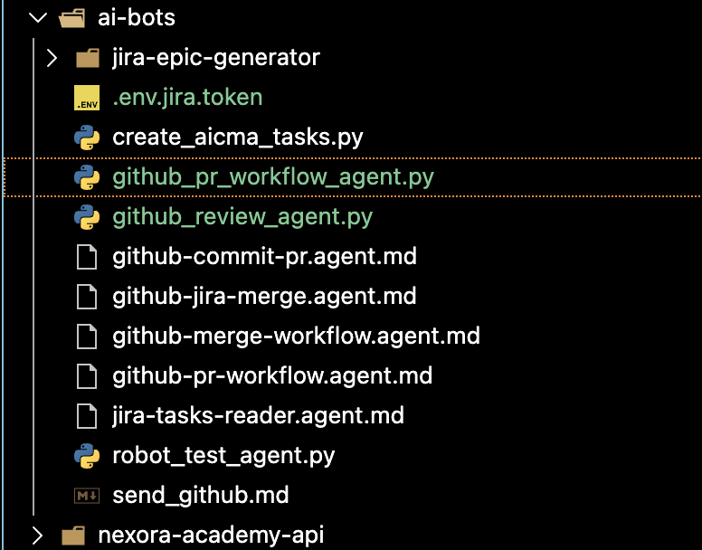
> Exibe a tela inicial do sistema, apresentando o dashboard e as principais opções de navegação para o usuário.

### 2. Listagem de Cursos
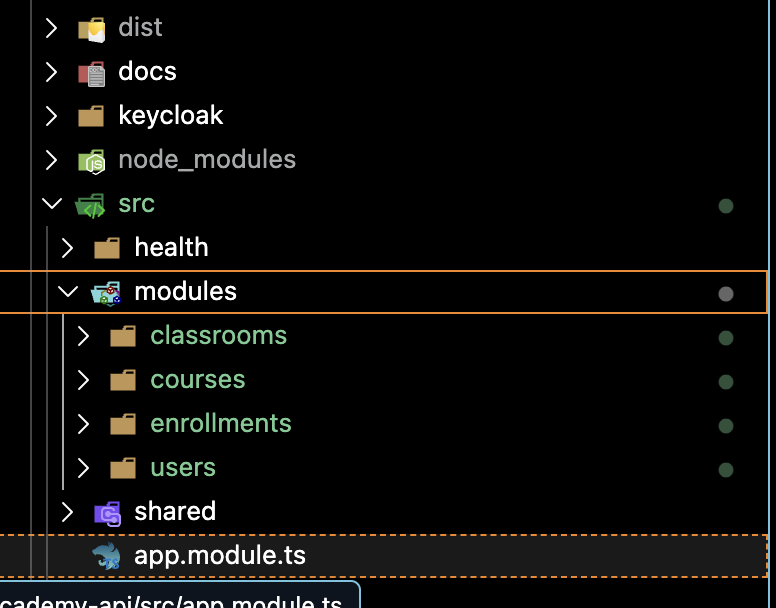
> Mostra a interface de listagem dos cursos disponíveis, permitindo ao usuário visualizar e acessar detalhes de cada curso.

### 3. Detalhes do Curso
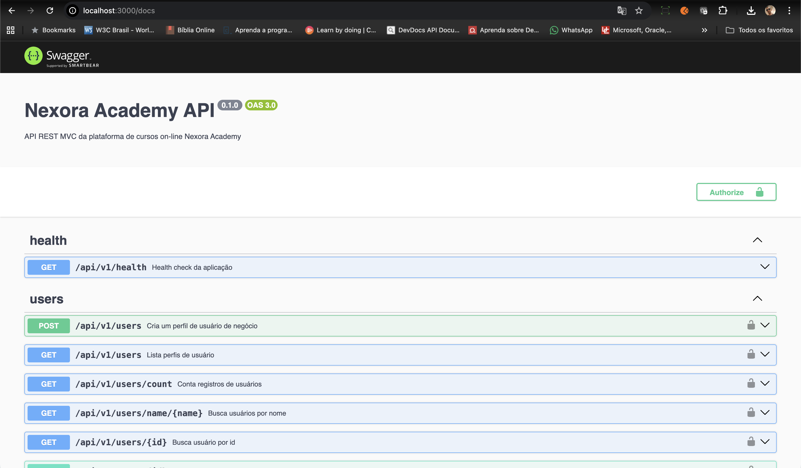
> Apresenta a tela de detalhes de um curso selecionado, incluindo informações, módulos e opções de inscrição.

### 4. Processo de Inscrição
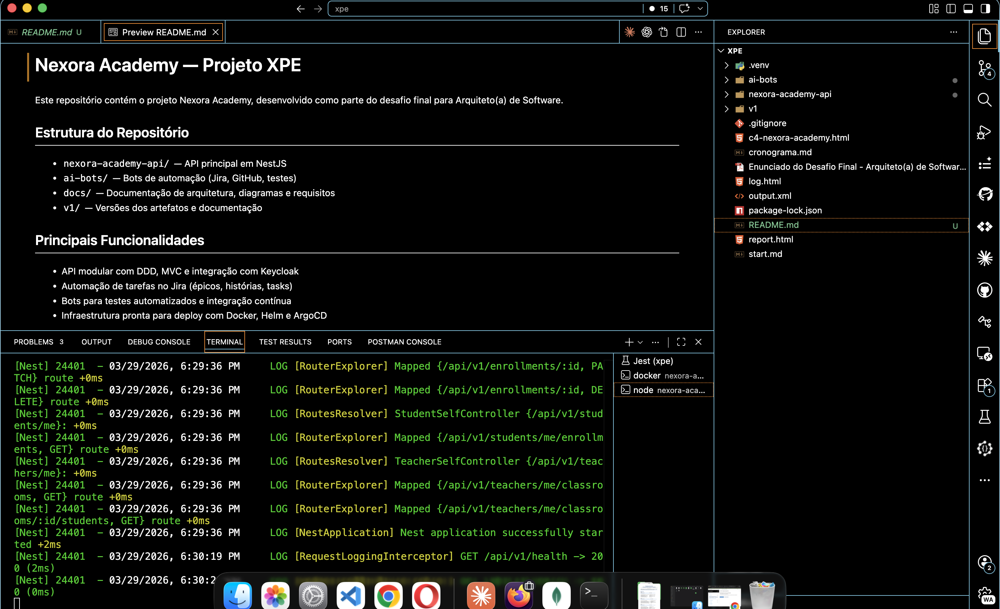
> Demonstra o fluxo de inscrição do usuário em um curso, com campos obrigatórios e confirmação da matrícula.

### 5. Área do Aluno
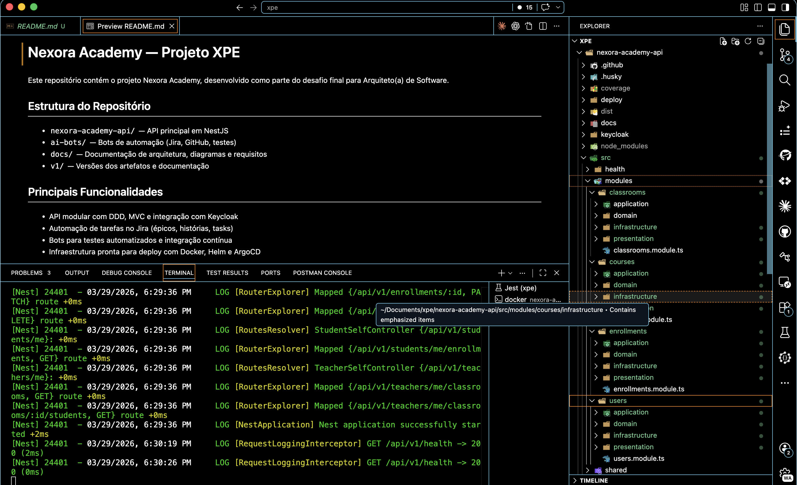
> Exibe a área restrita do aluno, onde é possível acompanhar o progresso, acessar conteúdos e visualizar certificados.

### 6. Administração de Usuários
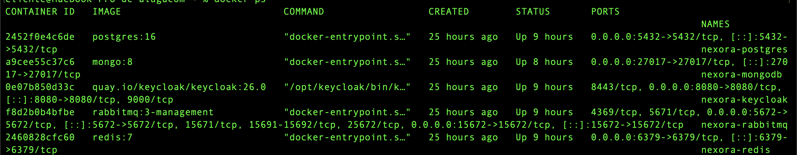
> Mostra a interface administrativa para gestão de usuários, incluindo permissões, cadastro e edição de perfis.

### 7. Commit Automatizado com IA
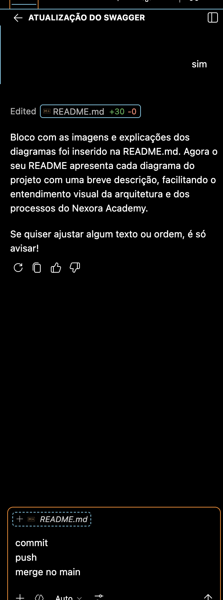
> Ilustra o processo de commit automatizado utilizando IA, onde o desenvolvedor fornece um resumo e os bots integram a alteração ao repositório de forma inteligente.

## Licença

MIT
